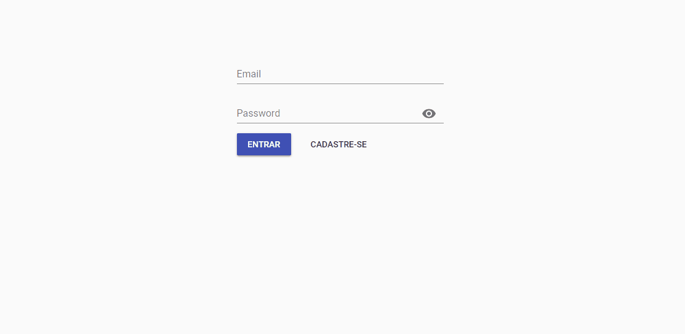

## Aplicação fullstack utilizando MongoDB, NodeJs, React e Redux
<p align="center">
  
  
  
  
  
  <br/>
  
</p>

#### Backend features
O banco de dados Mongo foi hospedado no MLab por conveniência.
Foi implementado gravatar para foto de perfil, se o email do usuário tiver um avatar
no wordpress ela automaticamente é salva no banco.
Rotas sensíveis foram protegidas por meio de JWT em conjunto com passport.


#### Usando
- Nodejs
  * Express
  * Nodemon - Para restartar o server sempre que houver uma alteração
  * Passport - Para proteger rotas privadas 
  * Jwt - Para proteger rotas privadas
  * Bcrypt - Para Cryptografar as senhas de usuários antes de salvar no banco
- MongoDB
  * Mongoose

#### Frontend features
Foi usado React em conjunto com Redux e React-router para construir a SPA.
Rotas protegidas redirecionam para a home e só são acessíveis por meio de auth.
Localstorage foi utilizado para persistir o state de usuário no recarregamento das páginas.

#### Usando
- React
  * Redux - Para gerenciar o state da aplicação
  * asyncRoutes - As rotas carregam em chunks, dessa forma evita da aplicação ficar pesada num primeiro carregamento
- Axios - Para fazer as requisições HTTP
- Local storage nativo - Para persistir o state e o auth nas rotas privadas
- MaterialUI components

## Como iniciar a aplicação

#### Requerimentos

- Node.js
- NPM

### Instalando os pacotes

Execute o comando abaixo para instalar as dependências:
``` bash
npm install
```

### Iniciando o servidor

Execute o comando abaixo para iniciar o Nodejs e conectar ao banco de dados MongoDB:
``` bash
npm run server
```

Aguarde a execução e a API estará rodando na Url  `http://localhost:8001/api/`

Os endpoints disponíveis são:
- Post - Login [more](https://documenter.getpostman.com/view/4374482/teste-fullstack/RW87p9Mq#0e46cf7d-edf9-416c-bfab-84022d8a346e)
- Post - Register [more](https://documenter.getpostman.com/view/4374482/teste-fullstack/RW87p9Mq#db625518-ec7d-41c7-9894-189322033ac6)
- Put  - Update Profile [more](https://documenter.getpostman.com/view/4374482/teste-fullstack/RW87p9Mq#ee34ae20-fe46-46f5-8666-7ed784448d65)
- Del  - Delete Account [more](https://documenter.getpostman.com/view/4374482/teste-fullstack/RW87p9Mq#1481a07f-160a-4b9c-ba95-7ceb20266b53)
- Get  - List Users [more](https://documenter.getpostman.com/view/4374482/teste-fullstack/RW87p9Mq#5f812e40-7bf1-47e8-87bb-1390b2fdf70b)

[A documentação completa pode ser encontrada no Postman](https://documenter.getpostman.com/view/4374482/teste-fullstack/RW87p9Mq)

Deixe o servidor rodando em um terminal, abra outro e siga para o próximo passo:

### Iniciando a SPA React

Para isso basta executar o comando abaixo, e pronto! :D
``` bash
npm start
```

A aplicação irá iniciar automaticamente no browser na Url `http://localhost:3000`

<br/>

### Copyright and license
The MIT License (MIT). Please see License File for more information.

<br/>
<br/>

<p align="center"></p>
<p align="center">
<sub>A little project by <a href="http://www.jeffersonribeiro.com/">Jefferson Ribeiro</a></sub>
</p>

